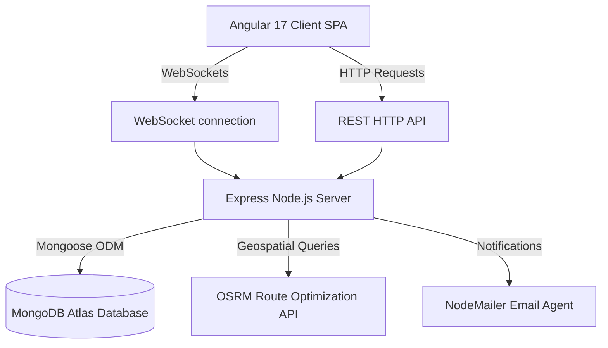

# Smart Waste Management System (WasteZero) - Technical Project Report

This technical report provides a detailed overview of the design, system architecture, database models, key feature implementations, and security components of the **Smart Waste Management System (WasteZero)**. It is designed to serve as a comprehensive guide for technical interviews, code reviews, and system deployment.

---

## 1. Executive Summary & Core Value Proposition

The **Smart Waste Management System (WasteZero)** is an intelligent, closed-loop platform designed to solve the structural inefficiencies of traditional municipal waste collection. By connecting citizens, volunteer agents, non-governmental organizations (NGOs), and municipal administrators, the platform streamlines the waste collection process, optimizes logistics, and encourages active public participation.

### Key Value Pillars
* **Active Citizen Engagement**: Citizens submit detailed waste request orders, track pickup requests in real-time, and earn redeemable reward points to incentivize recycling.
* **Geospatial Route Optimization**: Volunteer agents receive optimized routing paths (solving the Traveling Salesperson Problem) via integration with geospatial map APIs, reducing fuel consumption and collection times.
* **NGO & Community Synergy**: NGOs post volunteer opportunities and manage registrations, enabling coordinated local clean-up drives.
* **Data-Driven Administration**: Municipal admins supervise platform operations with real-time analytics graphs, log user audit histories, and enforce security policies (such as user suspension and 2FA authentication).

---

## 2. System Architecture & Tech Stack

The platform is designed around a decoupled, modern client-server architecture:



### Technical Stack Details
* **Frontend**: **Angular** (TypeScript Single Page Application)
  * **State Management & Async Operations**: RxJS Observables
  * **Maps & Geospatial Visualization**: Leaflet API & OpenStreetMap (OSM)
  * **Data Visualization**: Chart.js
  * **Internationalization**: `@ngx-translate` (English, Tamil, Hindi)
  * **Styling**: Custom CSS and Bootstrap 5
* **Backend**: **Node.js** + **Express** (TypeScript REST API)
  * **Real-time Synchronization**: Socket.io
  * **Database Interface**: Mongoose ODM
  * **Authentication**: JWT (JSON Web Tokens) & Google OAuth 2.0
  * **Natural Language Processing**: Sentiment Engine
  * **SMTP agent**: Nodemailer
* **Database**: **MongoDB Atlas** (NoSQL document storage)

---

## 3. Database Schema Models (Mongoose)

The platform utilizes a structured document-oriented schema optimized for fast retrieval, indexing, and aggregation:

### 3.1 User Model (`User.ts`)
Stores platform actors (Citizens, Volunteers/Agents, NGOs, Admins) and security fields.
| Field | Type | Description |
| :--- | :--- | :--- |
| `name` | String | User's full name (required) |
| `username` | String | Unique login username (indexed, required) |
| `email` | String | Unique email address (indexed, required) |
| `password` | String | Encrypted password string |
| `role` | String | Enums: `['user', 'volunteer', 'admin', 'citizen', 'ngo']` |
| `location` | String | User's primary locality address |
| `contactNumber`| String | Contact phone number |
| `rewardPoints` | Number | Earned points balance (defaults to `0`) |
| `isSuspended` | Boolean | Security suspension state flag |
| `isEmailVerified`| Boolean| Verification state of registered email |
| `twoFactorEnabled`| Boolean| Multi-factor authentication flag |
| `twoFactorSecret`| String | Shared secret key for TOTP MFA |
| `created_at` | Date | Timestamp of registration |

### 3.2 Waste Request Model (`WasteRequest.ts`)
Tracks pickup details, locations, waste weights, and statuses.
| Field | Type | Description |
| :--- | :--- | :--- |
| `citizenId` | String | ID of citizen requester |
| `citizenName` | String | Name of citizen requester |
| `location` | String | Address string for collection |
| `wasteCategory`| Array[String]| Enums: `['Plastic', 'Organic', 'E-Waste', 'Metal', 'Paper', 'Other']` |
| `status` | String | Enums: `['Pending', 'Scheduled', 'In Progress', 'Completed', 'Cancelled']` |
| `weight` | Number | Measured weight in kg |
| `volunteerId` | String | Assigned pickup volunteer ID |
| `scheduledDate`| Date | Scheduled pickup date |
| `createdAt` | Date | Request creation timestamp |

### 3.3 Security Login History (`LoginHistory.ts`)
Tracks authentication attempts for security audit logs.
| Field | Type | Description |
| :--- | :--- | :--- |
| `userId` | String | Reference to User ID |
| `email` | String | Email address used during authentication |
| `ipAddress` | String | IPv4/IPv6 client IP address |
| `userAgent` | String | Client browser agent signature |
| `status` | String | Status of attempt (`'success'` or `'failed'`) |
| `timestamp` | Date | Audit record creation date |

### 3.4 AI Feedback & Sentiment Model (`Feedback.ts`)
Stores platform feedback and natural language sentiment evaluation.
| Field | Type | Description |
| :--- | :--- | :--- |
| `userId` | String | Author User ID |
| `userName` | String | Author Name |
| `content` | String | Feedback text content |
| `sentimentScore`| Number | NLP sentiment value (positive/negative integers) |
| `isNegative` | Boolean | Auto-flag for administrative review |
| `createdAt` | Date | Date of feedback submission |

---

## 4. Technical Feature Walkthrough & Implementation

### 4.1 Real-Time Geospatial Maps (`my-pickups.component.ts`)
* **Objective**: Provide agents with visual mapping routes and allow citizens to track incoming agents.
* **Mechanism**:
  * Integrates **Leaflet.js** mapped to Leaflet Routing Machine.
  * Custom markers differentiate waste depots, pickup points, and the agent's current coordinates.
  * Geolocation API updates local coordinates which are emitted to the backend via WebSocket events.

### 4.2 Route Optimization Algorithm (`routeOptimizationController.ts`)
* **Objective**: Automate sorting of collection request orders to ensure volunteers follow the shortest path.
* **Mechanism**:
  1. Gathers all scheduled requests assigned to the agent.
  2. Resolves the Traveling Salesperson Problem (TSP) by building a coordinate distance matrix.
  3. Sends request coordinates to the **OSRM API** (`http://router.project-osrm.org/trip/v1/driving/`).
  4. Returns the optimized waypoint order, sorted coordinates, and total estimated duration/distance.
  ```typescript
  // Backend execution excerpt
  const osrmUrl = `http://router.project-osrm.org/trip/v1/driving/${coordString}?source=first&destination=any&roundtrip=false`;
  const response = await fetch(osrmUrl);
  const data = await response.json();
  const optimizedWays = data.waypoints.sort((a: any, b: any) => a.waypoint_index - b.waypoint_index);
  ```

### 4.3 Real-Time Aggregation Analytics Dashboard (`adminController.ts`)
* **Objective**: Generate live reports and graphs displaying system performance statistics.
* **Mechanism**:
  * Utilizes Mongoose `aggregate()` pipelines in parallel using `Promise.allSettled()` to prevent one slow database query from blocking other processes.
  * Dynamically computes location distributions, user growth curves, recycling metrics, and estimated revenue stats:
  ```typescript
  // Example: Category aggregation pipeline
  WasteRequest.aggregate([
      { $match: { status: 'Completed' } },
      { $unwind: '$wasteCategory' },
      { $group: {
          _id: '$wasteCategory',
          totalWeight: { $sum: '$weight' }
      }},
      { $sort: { totalWeight: -1 } }
  ])
  ```

### 4.4 Advanced User Security & Audit Logs
* **Objective**: Protect user accounts and detect fraudulent access.
* **Mechanism**:
  * **2FA TOTP Authentication**: Added multi-factor properties (`twoFactorEnabled`, `twoFactorSecret`) to users. Toggling 2FA prompts the server to issue a secure TOTP secret. Tries to match input verification codes during sign-in.
  * **Authentication Audit Trails**: Every login request invokes `LoginHistory.create(...)`, recording client IPs, user agents, and success states to allow security audits.

---

## 5. Interview Q&A Preparation Guide

Use this section to prepare for technical questions commonly asked in interviews regarding this system:

### Q1: Why did you choose MongoDB over a relational database like PostgreSQL for this project?
**Answer**: "We chose MongoDB for three primary reasons:
1. **Unstructured Data Adaptability**: Waste requests vary widely; some include photos, some have specific category arrays, and others have AI-predicted classification tags. A NoSQL schema-less structure makes it easy to store this dynamic data without executing complex SQL tables merges.
2. **Built-in Geospatial Indexing**: MongoDB natively supports `$near` queries and `2dsphere` indexes, which are perfect for querying waste request locations coordinates quickly.
3. **High Write Throughput**: Real-time GPS location updates and message tracking generate heavy write operations, which MongoDB handles with high throughput."

### Q2: How did you implement Route Optimization, and how does it scale as the number of pickups increases?
**Answer**: "Route optimization is handled by solving the Traveling Salesperson Problem (TSP). We collect the active pickup coordinates for a volunteer and query the Open Source Routing Machine (OSRM) trip service. OSRM uses contraction hierarchies to solve the trip optimization in milliseconds. 
To scale this as pickups increase, we restrict the maximum number of optimized waypoints per volunteer to 20 per trip, clustering pickups by geographic sectors before executing the routing algorithm. This avoids hitting computation limits on the routing server."

### Q3: How do the analytics charts update in real-time without locking the Node.js event loop?
**Answer**: "First, in the backend controller, we run all independent aggregation queries in parallel using `Promise.allSettled()`. This guarantees that long database operations do not block the thread consecutively. 
Second, on the frontend, Chart.js instances are created once and stored in memory. When new analytics updates arrive via HTTP polling, we call the `chart.update()` method instead of destroying and recreating the canvases. This avoids memory leaks and layout shifts."

### Q4: How is security handled on role-restricted endpoints like `/api/admin/users`?
**Answer**: "Security is handled in a two-stage middleware pipeline:
1. `authProtect`: Extracts the JWT from the Authorization header, validates the signature using our `JWT_SECRET`, checks if the token has expired, and attaches the user payload to the request object.
2. `requireRole(['admin'])`: Enforces Role-Based Access Control (RBAC). It checks the attached user's role against the permitted roles. If the roles do not match, it terminates the request immediately with a `403 Forbidden` status."
